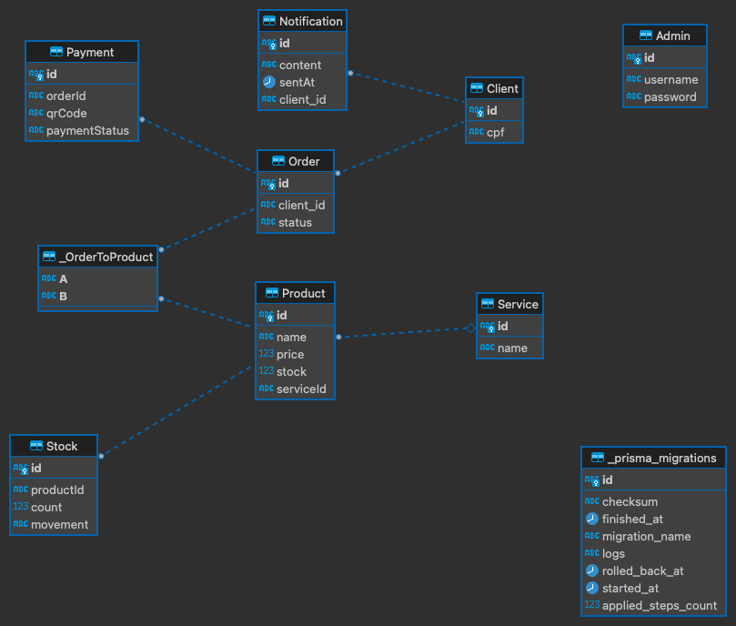

# Orderly

## Start application

```sh
npm run docker:start
```

## Run migrations

_Note: copy `.env.example` content to `.env`_

```sh
npm run db:migrate:dev
```

## ER Diagram



## Domain-Driven Design and Hexagonal Architecture

### 1.1. Entities

1. **Client**: Identified optionally by a Brazilian CPF.
2. **Payment**: Represents a transaction that will be used with OHS. Has an associated status (perhaps initiated, processed, confirmed).
3. **Order**: Represents a customer's request. It has associated status (Received, Preparing, Ready, Finalized).
4. **Service**: Represents the production of food. It has associated products and a client.
5. **Notification**: A medium for communication with the user and the restaurant. Will utilize an ACL for integration.
6. **Admin**: Handles promotional strategies and stock management.
7. **Stock**: Represents the available inventory of products.
8. **Product**: Items like Hamburger, Fries, Soda, etc.

### 1.2. Value Objects

1. **ProductDetails**: For `Product`, attributes like `Name`, `Description`, `NutritionalInfo`, etc., can be value objects. They don't have an identity on their own, but they describe a Product.
2. **PaymentDetails**: For `Payment`, attributes like `Amount`, `Currency`, `QRCode` can be value objects.
3. **NotificationContent**: For `Notification`, details like `Message`, `Timestamp`, and `Type` could be value objects.

### 1.3. Aggregates

1. **Check-in**: Rooted at `Client`, with `Order` being part of the aggregate.
2. **Check-out**: Rooted at `Order`, which affects both `Deliver` and `Production`.
3. **Communication**: Rooted at the `Notification` system, interfacing via an ACL.
4. **Billing**: Rooted at `Payment`, using ACL to conform with OHS.
5. **Admin**: Rooted at `Admin`, influencing the `Stock`.

### 1.4. Domain Events

1. **ClientRegistered**: Triggered when a client registers.
2. **ProductsSelected**: Triggered when products are selected.
3. **OrderCreated**: Triggered after order creation.
4. **PaymentProcessed**: Triggered during the payment process.
5. **PaymentApproved**: Triggered upon payment confirmation.
6. **StatusUpdatedToReceived**: Triggered when order status changes.
7. **ClientNotified**: Triggered to notify the client.
8. ... (Similar events for other status updates and notifications.)
